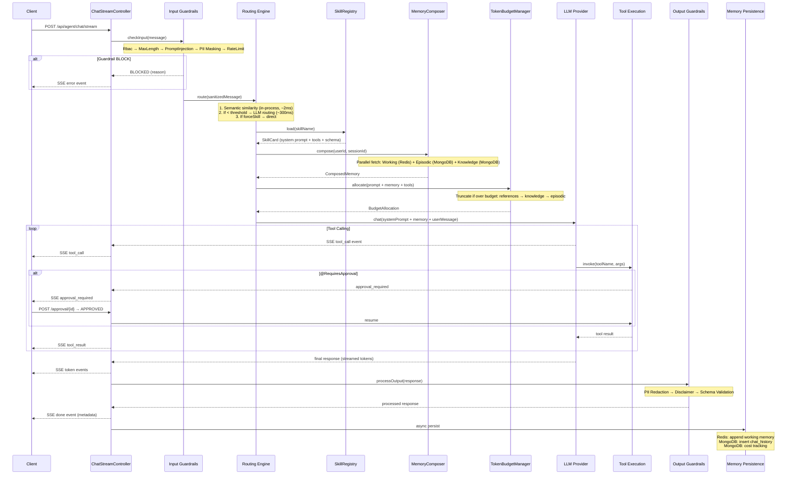
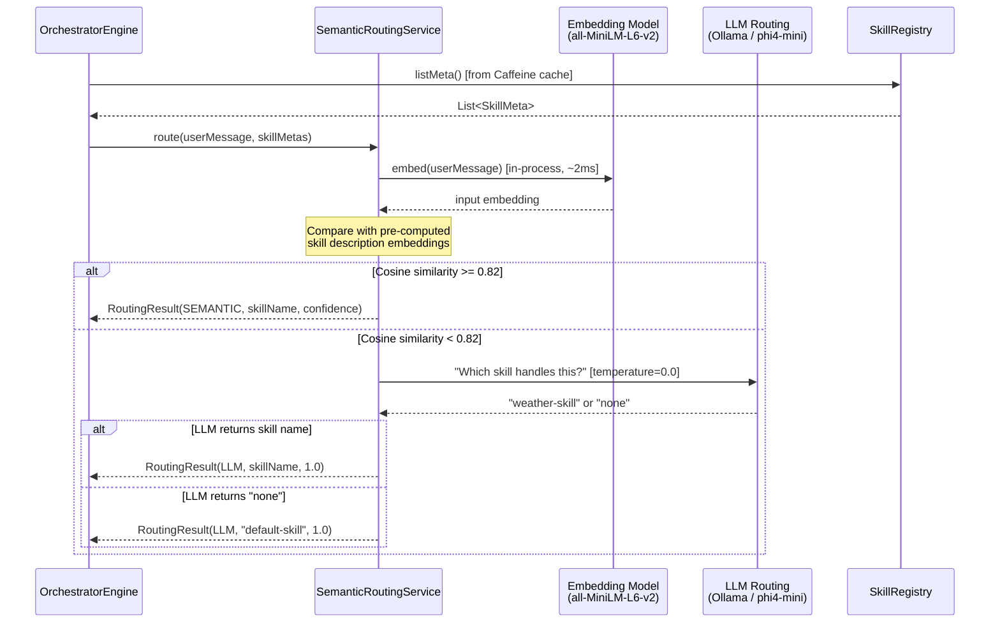
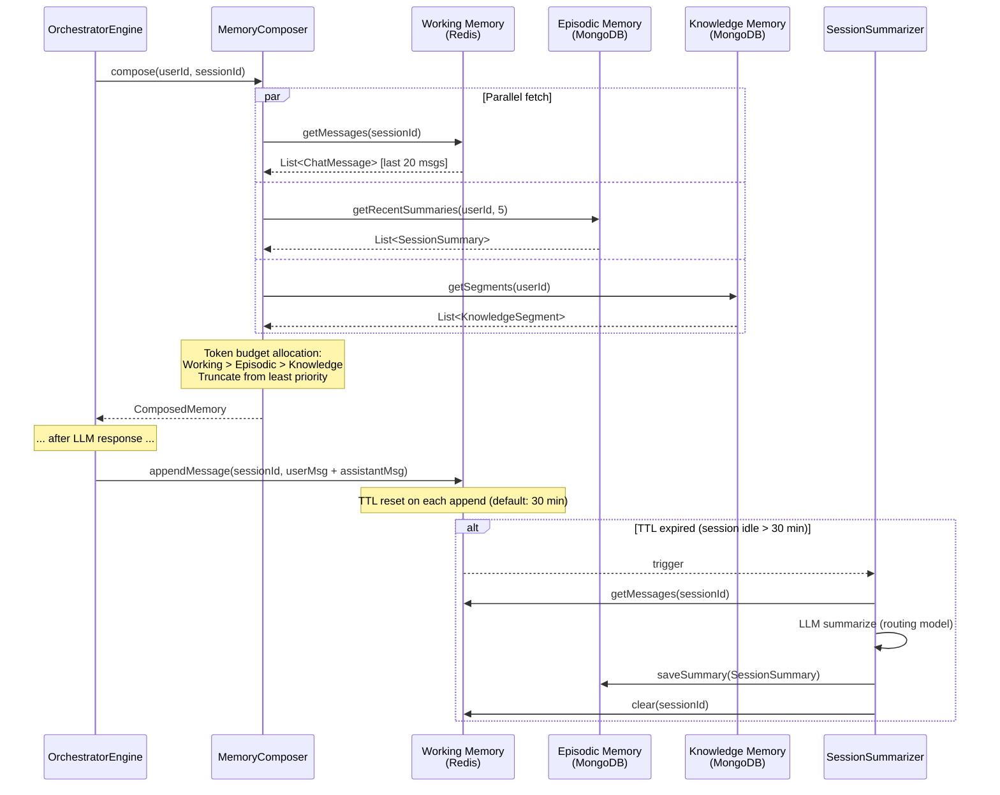
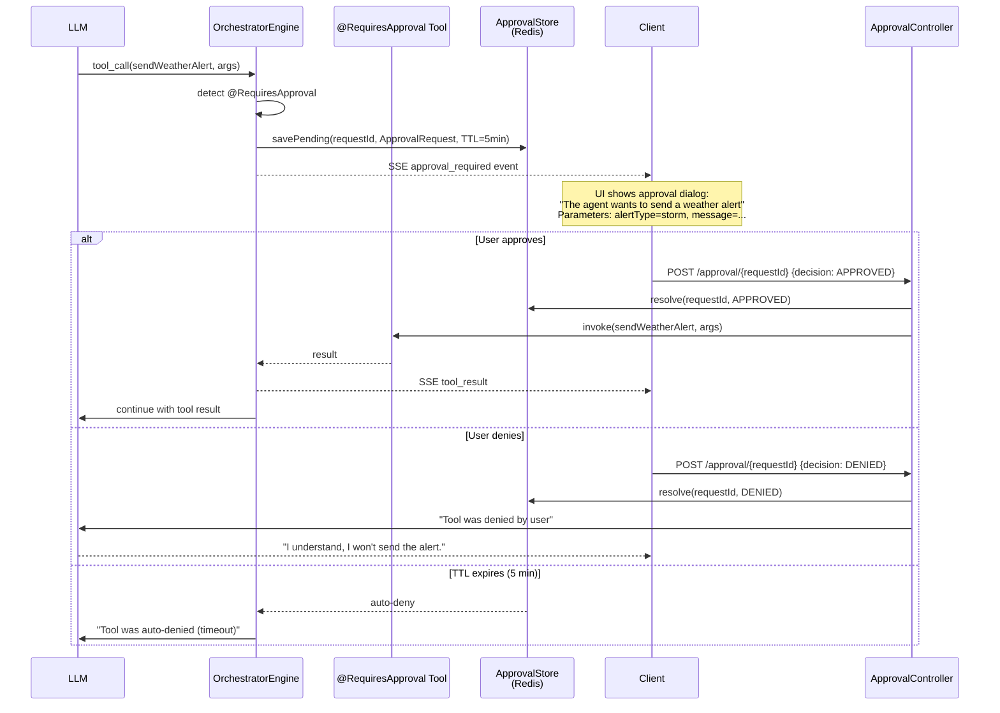
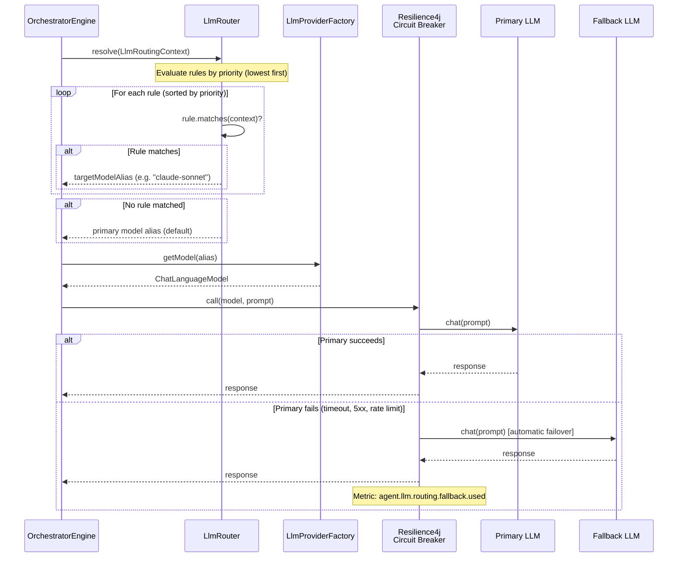
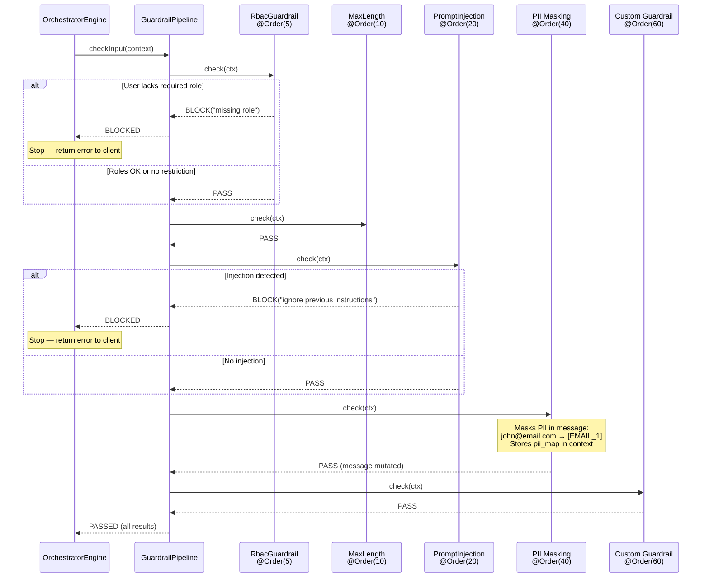
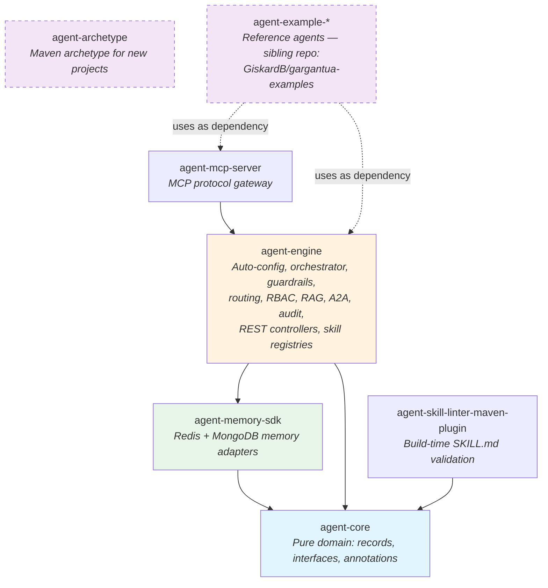
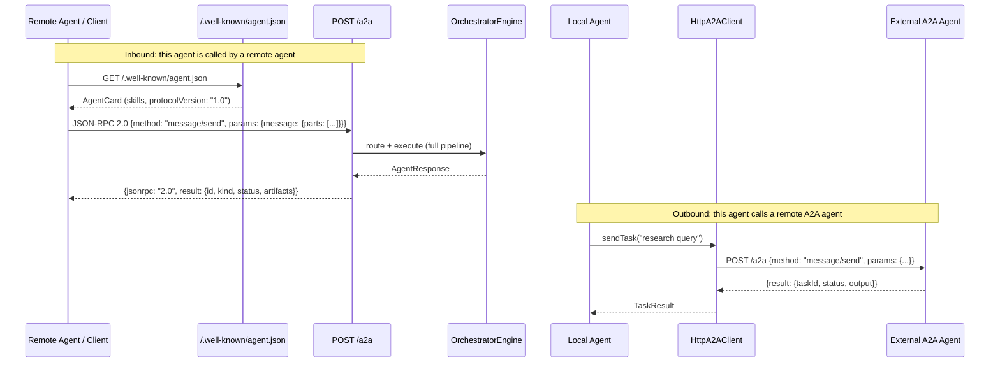

# Architecture Diagrams

## 1. Chat Request — Full Orchestration Flow

## 2. Skill Routing — Hybrid Strategy

## 3. Memory System — Three-Layer Architecture

## 4. Human-in-the-Loop (HITL) Approval Flow

## 5. LLM Rule-Based Routing

## 6. Guardrail Pipeline

## 7. Project Architecture — Module Dependencies

## 8. A2A Protocol — Agent-to-Agent Interaction

