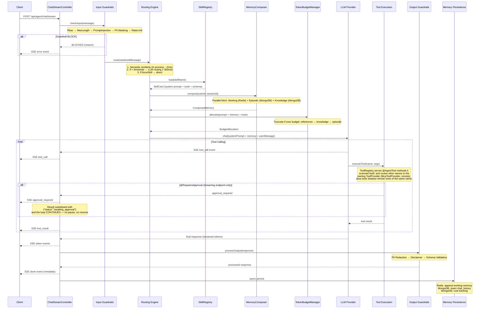
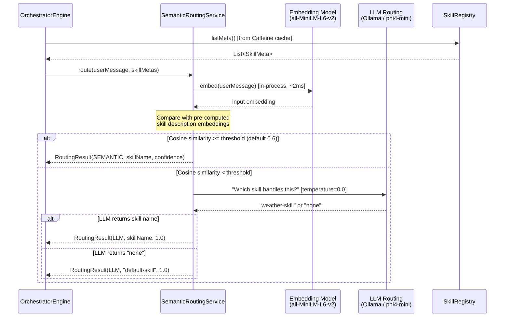
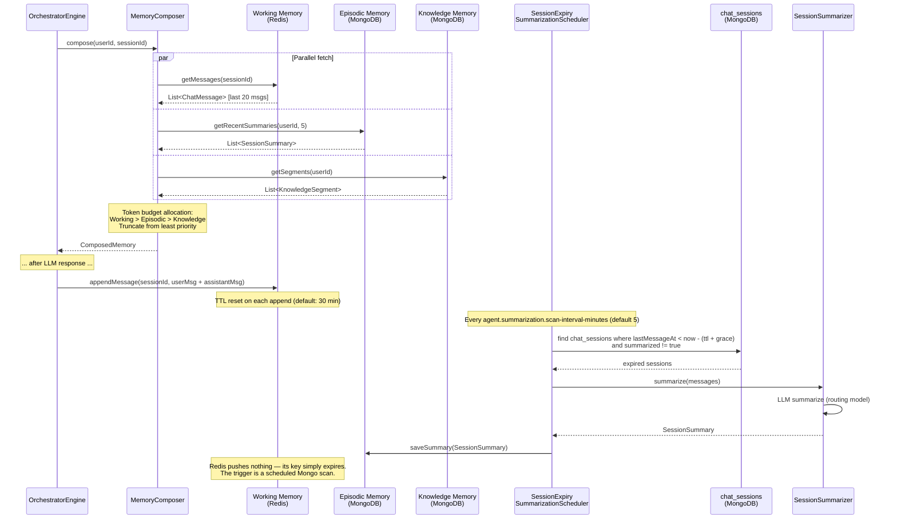
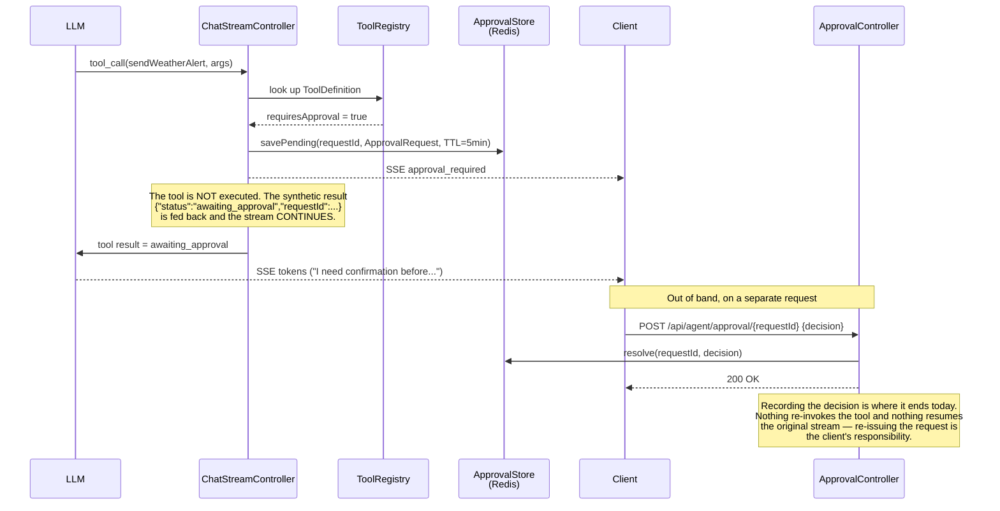
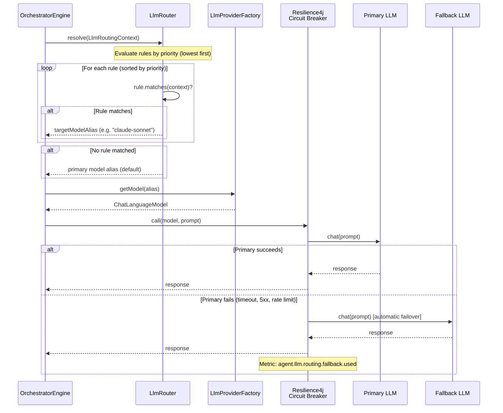
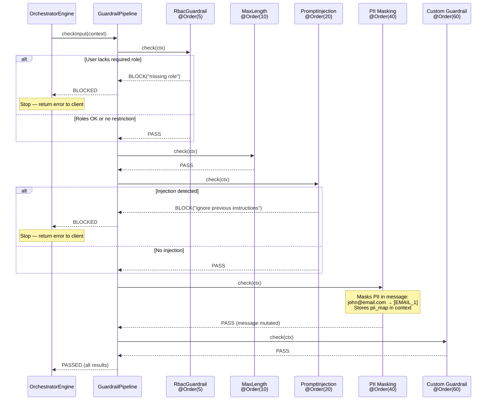
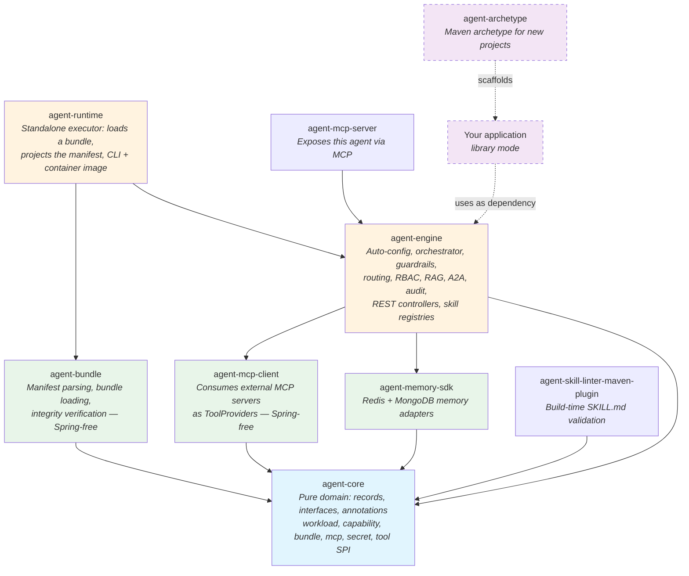
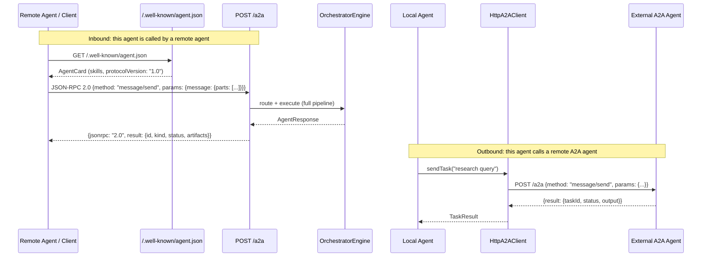

# Architecture Diagrams

## 1. Chat Request — Full Orchestration Flow

```mermaid
sequenceDiagram
    participant Client
    participant Controller as ChatStreamController
    participant Guard_In as Input Guardrails
    participant Router as Routing Engine
    participant Registry as SkillRegistry
    participant Memory as MemoryComposer
    participant Budget as TokenBudgetManager
    participant LLM as LLM Provider
    participant Tools as Tool Execution
    participant Guard_Out as Output Guardrails
    participant Persist as Memory Persistence

    Client->>Controller: POST /api/agent/chat/stream
    Controller->>Guard_In: checkInput(message)

    Note over Guard_In: Rbac → MaxLength → PromptInjection → PII Masking → RateLimit

    alt Guardrail BLOCK
        Guard_In-->>Controller: BLOCKED (reason)
        Controller-->>Client: SSE error event
    end

    Guard_In->>Router: route(sanitizedMessage)

    Note over Router: 1. Semantic similarity (in-process, ~2ms)<br/>2. If < threshold → LLM routing (~300ms)<br/>3. If forceSkill → direct

    Router->>Registry: load(skillName)
    Registry-->>Router: SkillCard (system prompt + tools + schema)

    Router->>Memory: compose(userId, sessionId)
    Note over Memory: Parallel fetch: Working (Redis) + Episodic (MongoDB) + Knowledge (MongoDB)
    Memory-->>Router: ComposedMemory

    Router->>Budget: allocate(prompt + memory + tools)
    Note over Budget: Truncate if over budget: references → knowledge → episodic
    Budget-->>Router: BudgetAllocation

    Router->>LLM: chat(systemPrompt + memory + userMessage)

    loop Tool Calling
        LLM-->>Controller: SSE tool_call event
        Controller-->>Client: SSE tool_call
        LLM->>Tools: executeTool(name, args)
        Note over Tools: ToolRegistry serves @AgentTool methods it<br/>scanned itself, and routes other names to the<br/>owning ToolProvider (McpToolProvider, remote).<br/>Java tools shadow remote ones of the same name.

        alt @RequiresApproval (streaming endpoint only)
            Tools-->>Controller: approval_required
            Controller-->>Client: SSE approval_required
            Note over Controller: Result substituted with<br/>{"status":"awaiting_approval"}<br/>and the loop CONTINUES — no pause, no resume
        end

        Tools-->>LLM: tool result
        Controller-->>Client: SSE tool_result
    end

    LLM-->>Controller: final response (streamed tokens)
    Controller-->>Client: SSE token events

    Controller->>Guard_Out: processOutput(response)
    Note over Guard_Out: PII Redaction → Disclaimer → Schema Validation
    Guard_Out-->>Controller: processed response

    Controller-->>Client: SSE done event (metadata)

    Controller->>Persist: async persist
    Note over Persist: Redis: append working memory<br/>MongoDB: insert chat_history<br/>MongoDB: cost tracking
```

## 2. Skill Routing — Hybrid Strategy

```mermaid
sequenceDiagram
    participant Engine as OrchestratorEngine
    participant Semantic as SemanticRoutingService
    participant Embed as Embedding Model<br/>(all-MiniLM-L6-v2)
    participant LLM_Route as LLM Routing<br/>(Ollama / phi4-mini)
    participant Registry as SkillRegistry

    Engine->>Registry: listMeta() [from Caffeine cache]
    Registry-->>Engine: List<SkillMeta>

    Engine->>Semantic: route(userMessage, skillMetas)
    Semantic->>Embed: embed(userMessage) [in-process, ~2ms]
    Embed-->>Semantic: input embedding

    Note over Semantic: Compare with pre-computed<br/>skill description embeddings

    alt Cosine similarity >= threshold (default 0.6)
        Semantic-->>Engine: RoutingResult(SEMANTIC, skillName, confidence)
    else Cosine similarity < threshold
        Semantic->>LLM_Route: "Which skill handles this?" [temperature=0.0]
        LLM_Route-->>Semantic: "weather-skill" or "none"
        alt LLM returns skill name
            Semantic-->>Engine: RoutingResult(LLM, skillName, 1.0)
        else LLM returns "none"
            Semantic-->>Engine: RoutingResult(LLM, "default-skill", 1.0)
        end
    end
```

## 3. Memory System — Three-Layer Architecture

```mermaid
sequenceDiagram
    participant Engine as OrchestratorEngine
    participant Composer as MemoryComposer
    participant Redis as Working Memory<br/>(Redis)
    participant Mongo_E as Episodic Memory<br/>(MongoDB)
    participant Mongo_K as Knowledge Memory<br/>(MongoDB)
    participant Scheduler as SessionExpiry<br/>SummarizationScheduler
    participant Mongo_S as chat_sessions<br/>(MongoDB)
    participant Summarizer as SessionSummarizer

    Engine->>Composer: compose(userId, sessionId)

    par Parallel fetch
        Composer->>Redis: getMessages(sessionId)
        Redis-->>Composer: List<ChatMessage> [last 20 msgs]
    and
        Composer->>Mongo_E: getRecentSummaries(userId, 5)
        Mongo_E-->>Composer: List<SessionSummary>
    and
        Composer->>Mongo_K: getSegments(userId)
        Mongo_K-->>Composer: List<KnowledgeSegment>
    end

    Note over Composer: Token budget allocation:<br/>Working > Episodic > Knowledge<br/>Truncate from least priority

    Composer-->>Engine: ComposedMemory

    Note over Engine: ... after LLM response ...

    Engine->>Redis: appendMessage(sessionId, userMsg + assistantMsg)
    Note over Redis: TTL reset on each append (default: 30 min)

    Note over Scheduler: Every agent.summarization.scan-interval-minutes (default 5)

    Scheduler->>Mongo_S: find chat_sessions where lastMessageAt < now - (ttl + grace)<br/>and summarized != true
    Mongo_S-->>Scheduler: expired sessions
    Scheduler->>Summarizer: summarize(messages)
    Summarizer->>Summarizer: LLM summarize (routing model)
    Summarizer-->>Scheduler: SessionSummary
    Scheduler->>Mongo_E: saveSummary(SessionSummary)

    Note over Redis: Redis pushes nothing — its key simply expires.<br/>The trigger is a scheduled Mongo scan.
```

## 4. Human-in-the-Loop (HITL) Approval Flow

```mermaid
sequenceDiagram
    participant LLM
    participant Controller as ChatStreamController
    participant Registry as ToolRegistry
    participant Store as ApprovalStore<br/>(Redis)
    participant Client
    participant Approval as ApprovalController

    LLM->>Controller: tool_call(sendWeatherAlert, args)
    Controller->>Registry: look up ToolDefinition
    Registry-->>Controller: requiresApproval = true

    Controller->>Store: savePending(requestId, ApprovalRequest, TTL=5min)
    Controller-->>Client: SSE approval_required

    Note over Controller: The tool is NOT executed. The synthetic result<br/>{"status":"awaiting_approval","requestId":...}<br/>is fed back and the stream CONTINUES.

    Controller->>LLM: tool result = awaiting_approval
    LLM-->>Client: SSE tokens ("I need confirmation before...")

    Note over Client,Approval: Out of band, on a separate request

    Client->>Approval: POST /api/agent/approval/{requestId} {decision}
    Approval->>Store: resolve(requestId, decision)
    Approval-->>Client: 200 OK

    Note over Approval: Recording the decision is where it ends today.<br/>Nothing re-invokes the tool and nothing resumes<br/>the original stream — re-issuing the request is<br/>the client's responsibility.
```

> **Known gap.** `@RequiresApproval` currently means "do not run this tool, and raise a
> request", not "run it once approved". There is no resume path: `ApprovalController` holds
> no reference to the tool registry or the SSE sink. The gate is also enforced **only** on
> `/api/agent/chat/stream` — the synchronous `/api/agent/chat` executes approval-gated
> tools without checking.

## 5. LLM Rule-Based Routing

```mermaid
sequenceDiagram
    participant Engine as OrchestratorEngine
    participant Router as LlmRouter
    participant Factory as LlmProviderFactory
    participant R4J as Resilience4j<br/>Circuit Breaker
    participant Primary as Primary LLM
    participant Fallback as Fallback LLM

    Engine->>Router: resolve(LlmRoutingContext)

    Note over Router: Evaluate rules by priority (lowest first)

    loop For each rule (sorted by priority)
        Router->>Router: rule.matches(context)?
        alt Rule matches
            Router-->>Engine: targetModelAlias (e.g. "claude-sonnet")
        end
    end

    alt No rule matched
        Router-->>Engine: primary model alias (default)
    end

    Engine->>Factory: getModel(alias)
    Factory-->>Engine: ChatLanguageModel

    Engine->>R4J: call(model, prompt)
    R4J->>Primary: chat(prompt)

    alt Primary succeeds
        Primary-->>R4J: response
        R4J-->>Engine: response
    else Primary fails (timeout, 5xx, rate limit)
        R4J->>Fallback: chat(prompt) [automatic failover]
        Fallback-->>R4J: response
        R4J-->>Engine: response
        Note over R4J: Metric: agent.llm.routing.fallback.used
    end
```

## 6. Guardrail Pipeline

```mermaid
sequenceDiagram
    participant Engine as OrchestratorEngine
    participant Pipeline as GuardrailPipeline
    participant G0 as RbacGuardrail<br/>@Order(5)
    participant G1 as MaxLength<br/>@Order(10)
    participant G2 as PromptInjection<br/>@Order(20)
    participant G3 as PII Masking<br/>@Order(40)
    participant GN as Custom Guardrail<br/>@Order(60)

    Engine->>Pipeline: checkInput(context)

    Pipeline->>G0: check(ctx)
    alt User lacks required role
        G0-->>Pipeline: BLOCK("missing role")
        Pipeline-->>Engine: BLOCKED
        Note over Engine: Stop — return error to client
    else Roles OK or no restriction
        G0-->>Pipeline: PASS
    end

    Pipeline->>G1: check(ctx)
    G1-->>Pipeline: PASS

    Pipeline->>G2: check(ctx)

    alt Injection detected
        G2-->>Pipeline: BLOCK("ignore previous instructions")
        Pipeline-->>Engine: BLOCKED
        Note over Engine: Stop — return error to client
    else No injection
        G2-->>Pipeline: PASS
    end

    Pipeline->>G3: check(ctx)
    Note over G3: Masks PII in message:<br/>john@email.com → [EMAIL_1]<br/>Stores pii_map in context
    G3-->>Pipeline: PASS (message mutated)

    Pipeline->>GN: check(ctx)
    GN-->>Pipeline: PASS

    Pipeline-->>Engine: PASSED (all results)
```

## 7. Project Architecture — Module Dependencies

```mermaid
graph TD
    CORE[agent-core<br/><i>Pure domain: records, interfaces, annotations<br/>workload, capability, bundle, mcp, secret, tool SPI</i>]

    MEMORY[agent-memory-sdk<br/><i>Redis + MongoDB memory adapters</i>]

    MCPCLIENT[agent-mcp-client<br/><i>Consumes external MCP servers<br/>as ToolProviders — Spring-free</i>]

    BUNDLE[agent-bundle<br/><i>Manifest parsing, bundle loading,<br/>integrity verification — Spring-free</i>]

    ENGINE[agent-engine<br/><i>Auto-config, orchestrator, guardrails,<br/>routing, RBAC, RAG, A2A, audit,<br/>REST controllers, skill registries</i>]

    RUNTIME[agent-runtime<br/><i>Standalone executor: loads a bundle,<br/>projects the manifest, CLI + container image</i>]

    MCP[agent-mcp-server<br/><i>Exposes this agent via MCP</i>]

    LINTER[agent-skill-linter-maven-plugin<br/><i>Build-time SKILL.md validation</i>]

    ARCHETYPE[agent-archetype<br/><i>Maven archetype for new projects</i>]

    APP[Your application<br/><i>library mode</i>]

    MEMORY --> CORE
    MCPCLIENT --> CORE
    BUNDLE --> CORE
    ENGINE --> CORE
    ENGINE --> MEMORY
    ENGINE --> MCPCLIENT
    RUNTIME --> ENGINE
    RUNTIME --> BUNDLE
    MCP --> ENGINE
    LINTER --> CORE

    APP -.->|uses as dependency| ENGINE
    ARCHETYPE -.->|scaffolds| APP

    style CORE fill:#e1f5fe
    style MEMORY fill:#e8f5e9
    style MCPCLIENT fill:#e8f5e9
    style BUNDLE fill:#e8f5e9
    style ENGINE fill:#fff3e0
    style RUNTIME fill:#fff3e0
    style APP fill:#f3e5f5,stroke-dasharray: 5 5
    style ARCHETYPE fill:#f3e5f5,stroke-dasharray: 5 5
```

`agent-core`, `agent-bundle` and `agent-mcp-client` carry no Spring dependency — the first
because it is the pure domain, the other two because both `agent-engine` (library mode) and
`agent-runtime` consume them and neither may be assumed. CI enforces this.

The two delivery modes are the two orange boxes: **your application** depends on
`agent-engine`, or **`agent-runtime`** loads a bundle. Both drive the same engine.

## 8. A2A Protocol — Agent-to-Agent Interaction

```mermaid
sequenceDiagram
    participant Remote as Remote Agent / Client
    participant WK as /.well-known/agent.json
    participant A2A as POST /a2a
    participant Engine as OrchestratorEngine
    participant Local as Local Agent
    participant HttpClient as HttpA2AClient
    participant ExtAgent as External A2A Agent

    Note over Remote,A2A: Inbound: this agent is called by a remote agent

    Remote->>WK: GET /.well-known/agent.json
    WK-->>Remote: AgentCard (skills, protocolVersion: "1.0")

    Remote->>A2A: JSON-RPC 2.0 {method: "message/send", params: {message: {parts: [...]}}}
    A2A->>Engine: route + execute (full pipeline)
    Engine-->>A2A: AgentResponse
    A2A-->>Remote: {jsonrpc: "2.0", result: {id, kind, status, artifacts}}

    Note over Local,ExtAgent: Outbound: this agent calls a remote A2A agent

    Local->>HttpClient: sendTask("research query")
    HttpClient->>ExtAgent: POST /a2a {method: "message/send", params: {...}}
    ExtAgent-->>HttpClient: {result: {taskId, status, output}}
    HttpClient-->>Local: TaskResult
```
