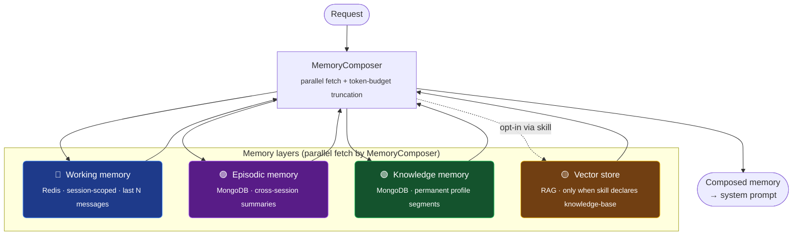
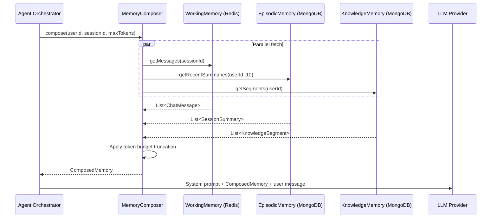

# Memory System

## What the memory system does

Agents need to remember past conversations (working memory), learn from previous sessions (episodic memory), and know the user across all interactions (knowledge memory). Without memory, every message starts from zero -- the agent has no idea what was said five minutes ago, no recall of last week's session, and no awareness of user preferences. The Gargantua memory system solves this with three layers that are composed in parallel and injected into the system prompt as context, giving the LLM everything it needs to produce coherent, personalized responses.

## Architecture diagram

The four memory layers stack like this:

| Layer | Backend | Scope | Default policy | When it's queried |
|-------|---------|-------|----------------|--------------------|
| 🔵 **Working memory** | Redis | Per session | 20 messages · 30 min sliding TTL | Every request |
| 🟣 **Episodic memory** | MongoDB | Per user, cross-session | 5 most-recent summaries · 365 day TTL | Every request |
| 🟢 **Knowledge memory** | MongoDB | Per user, permanent | Segment-based (key/value), no TTL | Every request |
| 🟡 **Vector store (RAG)** | `VectorStorePort` (default: in-memory keyword, see [WIP note](extending.md#rag--vector-store)) | Per skill | Activated only when the skill's `metadata.knowledge-base` is set | Only when the active skill declares a knowledge base |



> In embedded mode (`SPRING_PROFILES_ACTIVE=embedded`) every layer is
> replaced by an in-memory `ConcurrentHashMap`-backed adapter; the API is
> identical but data is lost on restart. See the project README "Run
> modes" table for the complete list.

The following sequence shows how the `MemoryComposer` assembles context for each request:



## Working Memory (Redis)

Working memory stores the last N messages of the current conversation. It is session-scoped -- each conversation gets its own Redis key -- and exists only as long as the session is active.

**How it works:**

- Each message (role + content + timestamp) is appended to a Redis LIST.
- Redis key pattern: `working_memory:{sessionId}`
- After each append, `LTRIM` keeps only the most recent `maxMessages` entries. This creates a sliding window: the oldest messages drop off as new ones arrive.
- The TTL is reset on every new message. As long as the user keeps chatting, the session stays alive.
- When the TTL expires (no new messages for `ttlMinutes`), the key vanishes from Redis. The orchestrator can then trigger the `SessionSummarizer` to compress the conversation into episodic memory before the data is lost.

**Key behaviors:**

| Behavior | Detail |
|----------|--------|
| Storage | Redis LIST of JSON-serialized `ChatMessage` records |
| Key format | `working_memory:{sessionId}` |
| Sliding window | `LTRIM` to `maxMessages` on every append |
| TTL reset | `EXPIRE` reset on every append |
| TTL expiry | Key disappears; triggers summarization into episodic memory |

**Configuration:**
```yaml
agent:
  memory:
    working:
      max-messages: 20     # sliding window size
      ttl-minutes: 30      # inactivity timeout
```

The `agentkit.memory.working.*` prefix applies when using the standalone SDK directly (see below).

## Episodic Memory (MongoDB)

Episodic memory stores compressed summaries of past sessions. It gives the agent long-term recall: "Last week you asked about your mortgage options and we discussed refinancing."

**How summaries are created:**

When working memory TTL expires, the `SessionSummarizer` is triggered. It receives the full list of messages from the expiring session and produces a `SessionSummary` containing a text summary, extracted key topics, and any unresolved items (open questions or pending tasks).

The default implementation is `RoutingModelSessionSummarizer` (registered automatically when an `LlmProviderFactory` is on the classpath). It calls the routing model (`agent.llm.routing-model.*`, typically a small local model like Ollama) with a structured prompt that requests a single JSON object — `summary`, `keyTopics` (≤ 5), `unresolvedItems` (≤ 5). Malformed or partial responses fall back to a deterministic concatenation of the transcript so the caller always gets a non-null summary. Override with your own `SessionSummarizer` `@Bean` to swap the prompt, the model, or the parsing.

The TTL-expiry trigger is `SessionExpirySummarizationScheduler`: a Spring-`@Scheduled` job that scans the `chat_sessions` Mongo collection (populated by `DefaultOrchestratorEngine`) for documents where `lastMessageAt` is older than the working-memory TTL plus a grace window and `summarized != true`. Each match is summarised via `SessionSummarizer.summarize` and the resulting `SessionSummary` is persisted via `EpisodicMemoryPort`. Configure with:

```yaml
agent:
  summarization:
    enabled: true            # master switch (default true)
    scan-interval-minutes: 5 # scheduler period
    grace-minutes: 1         # extra wait beyond working.ttlMinutes before summarising
```

The scheduler is conditional on `MongoTemplate` being available — embedded-mode deployments without Mongo skip it and must invoke the summarizer manually.

**MongoDB collection:** `session_summaries`

**Document fields:**

| Field | Type | Description |
|-------|------|-------------|
| `userId` | String | The user who participated in the session |
| `sessionId` | String | Original session identifier |
| `summary` | String | Compressed text summary of the conversation |
| `keyTopics` | List\<String\> | Extracted topic keywords for search and filtering |
| `unresolvedItems` | List\<String\> | Open questions or tasks from the session |
| `messageCount` | int | How many messages were in the original session |
| `sessionDate` | Instant | When the session started |
| `expiresAt` | Instant | Optional TTL for the summary itself (null = never expires) |

**Retrieval:** Summaries are sorted by `sessionDate` descending. The composer currently fetches up to 10 summaries per request (hardcoded) and then applies token budget truncation.

**Configuration:**
```yaml
agent:
  memory:
    episodic:
      max-summaries: 5     # max summaries fetched by MemoryComposer per compose() call
      ttl-days: 365        # honored via a Mongo TTL index on `expiresAt` (defaulted on insert when null)
```

## Knowledge Memory (MongoDB)

Knowledge memory stores persistent user profile data that spans all sessions. It captures preferences, settings, and contextual facts about the user -- things like "prefers formal tone", "works in finance", or "timezone is CET".

**How it works:**

Knowledge is organized into segments. Each segment has a `segmentKey` (e.g., `"preferences"`, `"profile"`, `"financial_context"`) and a `content` string. Segments are upserted by `userId + segmentKey`, so updating a segment replaces its content entirely.

**MongoDB collection:** `user_knowledge`

**Document fields:**

| Field | Type | Description |
|-------|------|-------------|
| `userId` | String | The user this knowledge belongs to |
| `segmentKey` | String | Unique key within the user's knowledge (e.g., `"preferences"`) |
| `content` | String | The knowledge text |
| `updatedAt` | Instant | Last modification timestamp |
| `source` | String | Origin of this knowledge: `"user"`, `"agent"`, or `"admin"` |

**Example segments:**
```
userId: "user-42"
segmentKey: "preferences"
content: "Likes concise answers. Prefers bullet points over paragraphs."
source: "agent"

userId: "user-42"
segmentKey: "financial_profile"
content: "Has a savings account and a mortgage. Interested in ETFs."
source: "user"
```

**Configuration:**
```yaml
agent:
  memory:
    knowledge:
      max-segments: 10              # cap on the number of segments returned per user
      max-tokens-per-segment: 400   # content of each segment is truncated to ~maxTokens × 4 chars
```

## Memory Composer

The `MemoryComposer` is the central piece that fetches all three layers and merges them into a single `ComposedMemory` object ready for prompt injection.

**Parallel fetch.** All three layers are fetched simultaneously using `CompletableFuture.allOf()`. This means memory retrieval takes as long as the slowest layer, not the sum of all three.

**Per-skill opt-out.** A skill can declare which layers it actually needs via `memory-layers` in `SKILL.md` frontmatter (under `metadata`). Layers omitted from the list are skipped entirely — their backing port (Redis or MongoDB) is never queried. When the field is absent, all three layers are fetched (default).

```yaml
---
name: greeting-skill
description: Lightweight greeting handler for hello/goodbye messages.
version: 1.0.0
metadata:
  active: true
  memory-layers: [working]   # skip episodic + knowledge — saves ~1 MongoDB round-trip
---
```

Allowed values are `working`, `episodic`, `knowledge` (case-insensitive). Use this for stateless skills — greetings, simple Q&A, status checks — where past sessions and stored user knowledge add no value to the prompt.

**Token budget truncation.** The composed result must fit within `maxContextTokens`. When the total exceeds the budget, layers are truncated in priority order:

1. **Knowledge segments** are trimmed first (lowest priority). Segments are removed one at a time until the budget fits.
2. **Episodic summaries** are trimmed next (oldest first -- the list is sorted newest-first, so removal happens from the end).
3. **Working messages** are never truncated. They represent the current conversation and have the highest priority.

Token estimation uses a simple heuristic: `text.length() / 4`.

**Result.** The `ComposedMemory` record contains:
- `workingMessages` -- current conversation messages
- `episodicSummaries` -- past session summaries (after truncation)
- `knowledgeSegments` -- user knowledge (after truncation)
- `estimatedTokens` -- total estimated token count

This is injected into the system prompt by the agent orchestrator.

**Configuration:**
```yaml
agent:
  memory:
    composer:
      max-context-tokens: 3000   # total token budget for all memory layers
```

## Embedded mode

When `SPRING_PROFILES_ACTIVE=embedded`, all memory adapters switch to in-memory implementations backed by `ConcurrentHashMap`. No Redis or MongoDB is required.

| Layer | Production adapter | Embedded adapter |
|-------|-------------------|------------------|
| Working Memory | `RedisWorkingMemoryAdapter` | `InMemoryWorkingMemoryAdapter` |
| Episodic Memory | `MongoEpisodicMemoryAdapter` | `InMemoryEpisodicMemoryAdapter` |
| Knowledge Memory | `MongoKnowledgeMemoryAdapter` | `InMemoryKnowledgeMemoryAdapter` |

The in-memory working memory adapter mirrors Redis behavior: it enforces a sliding window via `maxMessages`, resets TTL on every append, and lazily evicts expired sessions on read.

**All data is lost when the process stops.** Do not use embedded mode in production. It is designed for local development, demos, and integration testing.

## Configuration

The full YAML below shows every memory config key with its default value. There are two config prefixes depending on context:

- `agent.memory.*` -- used when running the full framework (`AgentProperties`)
- `agentkit.memory.*` -- used by the standalone `agent-memory-sdk` JAR (`AgentMemoryProperties`)

Both bind to the same structure:

```yaml
agent:
  memory:
    working:
      max-messages: 20             # messages to retain per session (sliding window)
      ttl-minutes: 30              # session inactivity timeout in minutes
    episodic:
      max-summaries: 5             # max summaries to store per user
      ttl-days: 365                # summary retention in days
    knowledge:
      max-segments: 10             # max knowledge segments per user
      max-tokens-per-segment: 400  # token budget per individual segment
    composer:
      max-context-tokens: 3000     # total token budget for composed memory
```

## Infrastructure requirements

The memory system uses **MongoDB** and **Redis** in standard mode. In **embedded mode** (`SPRING_PROFILES_ACTIVE=embedded`) those layers are replaced by in-memory `ConcurrentHashMap` adapters and no infrastructure is needed.

| Service | Used by | What happens if it is missing |
|---------|---------|-------------------------------|
| **Redis** | Working Memory | The Redis-backed adapter does not register (its bean is `@ConditionalOnBean(StringRedisTemplate.class)`). With no replacement bean, working memory is unavailable; in embedded mode `EmbeddedProfileAutoConfiguration` registers an in-memory `WorkingMemoryPort` instead. |
| **MongoDB** | Episodic Memory, Knowledge Memory | Same pattern: the MongoDB adapters are `@ConditionalOnBean(MongoTemplate.class)` and silently skip registration when MongoDB isn't on the classpath / not configured. Embedded mode supplies in-memory replacements. |

Start the stores with Docker (standard mode):
```bash
docker compose up -d mongo redis
```

The agent connects to:
- MongoDB at `mongodb://localhost:27017` (configurable via `MONGODB_URI`)
- Redis at `redis://localhost:6379` (configurable via `REDIS_URL`)

No manual database setup, schema migration, or collection creation is needed. The framework creates everything on first use.

## Standalone library

The memory layer is published as a separate Maven artifact (`ai.gargantua:agent-memory-sdk`) that you can use in any Spring Boot project without pulling in the full framework.

```xml
<dependency>
    <groupId>ai.gargantua</groupId>
    <artifactId>agent-memory-sdk</artifactId>
    <version>1.0.0</version>
</dependency>
```

The SDK auto-configures all three adapters and the `MemoryComposer` via `AgentMemoryAutoConfiguration`. Configuration binds to the `agentkit.memory.*` prefix:

```yaml
agentkit:
  memory:
    working:
      max-messages: 20
      ttl-minutes: 30
    episodic:
      max-summaries: 5
      ttl-days: 365
    knowledge:
      max-segments: 10
      max-tokens-per-segment: 400
    composer:
      max-context-tokens: 3000
```

Every bean in the auto-configuration uses `@ConditionalOnBean` to require its backing template (`MongoTemplate` for episodic/knowledge, `StringRedisTemplate` for working) and `@ConditionalOnMissingBean` so you can override any adapter by declaring your own bean. When the backing template isn't available the adapter simply isn't registered — `EmbeddedProfileAutoConfiguration` (active under the `embedded` profile) provides in-memory drop-ins instead.

## Override adapters

To replace any memory implementation, declare a Spring `@Bean` that implements the corresponding port interface. The framework's default adapter will back off automatically.

**Example: custom working memory**
```java
import ai.gargantua.core.memory.WorkingMemoryPort;
import ai.gargantua.core.memory.ChatMessage;
import org.springframework.context.annotation.Bean;
import org.springframework.context.annotation.Configuration;

@Configuration
public class CustomMemoryConfig {

    @Bean
    public WorkingMemoryPort workingMemory() {
        return new MyDynamoDbWorkingMemory();
    }
}
```

Because `AgentMemoryAutoConfiguration` declares its `WorkingMemoryPort` bean with `@ConditionalOnMissingBean(WorkingMemoryPort.class)`, your custom bean takes precedence. The same pattern works for all three ports:

| Port interface | Default adapter | Override to use |
|---------------|----------------|-----------------|
| `WorkingMemoryPort` | `RedisWorkingMemoryAdapter` | Any Redis-compatible store, DynamoDB, etc. |
| `EpisodicMemoryPort` | `MongoEpisodicMemoryAdapter` | PostgreSQL, Elasticsearch, etc. |
| `KnowledgeMemoryPort` | `MongoKnowledgeMemoryAdapter` | PostgreSQL, a CRM system, etc. |

**In-memory stubs for testing.** The SDK ships with `InMemoryWorkingMemoryAdapter`, `InMemoryEpisodicMemoryAdapter`, and `InMemoryKnowledgeMemoryAdapter` in the `ai.gargantua.memory.adapters.inmemory` package. Use these in tests instead of mocking:

```java
@Bean
public WorkingMemoryPort workingMemory() {
    return new InMemoryWorkingMemoryAdapter(20, 30 * 60 * 1000L);
}
```

These stubs are also available as separate test-scope classes in `agent-memory-sdk/src/test/java` for unit tests that do not use Spring context.
